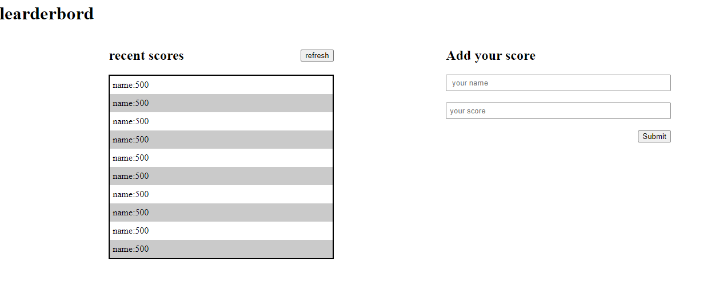

# LeaderBoard

> This project was built for Microverse [under these guidance objectives](https://github.com/microverseinc/curriculum-javascript/blob/main/leaderboard/sneak_peek.md)
> _note: you can only access this link if you're a Micronault (Microverse Student)_

Additional description about the project and its features.




 

## Live Demo

[Live Demo Link](/)
 
## Built With

- HTML
- CSS
- Javascript
- HTML&CSS Linter

## Get Started

Please get your browser update.
To get a local copy up and running follow these simple steps.

Run the command below from the Terminal:

      git clone <URL> 'https://github.com/mwanawabangona/learderboard/issues' in your terminal

	  cd branch-B

	 
  ```cd Leaderboard```

> install project dependencies

  ```npm install```

> build project

  ```npm run build```

> start project

  ```npm start```


## Authors

👤 **Ellis**

- Location: Zambia
- GitHub: [@mwnanawabangona](https://github.com/mwanawabangona)
- Twitter: [@Ellis_aah](https://twitter.com/Ellis-aah)
- LinkedIn: [LinkedIn](https://www.linkedin.com/)


## 🤝 Contributing

Contributions, issues, and feature requests are welcome!

Feel free to check the [issues page](https://github.com/mwanawabangona/learderbord/issues).

## Show your support

Give a ⭐️ if you like this project!

## Acknowledgments

- Thanks to Microverse and my Coding Partners
- My Learning Partners
## 📝 License

This project is [MIT](./MIT.md) licensed.
